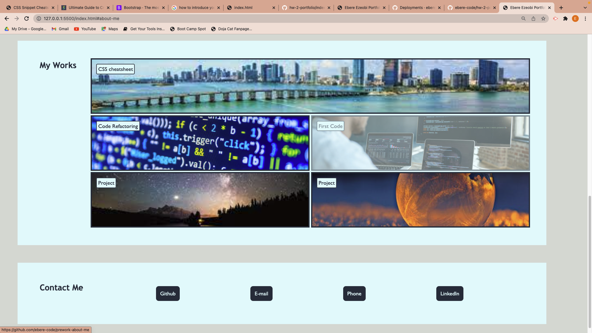
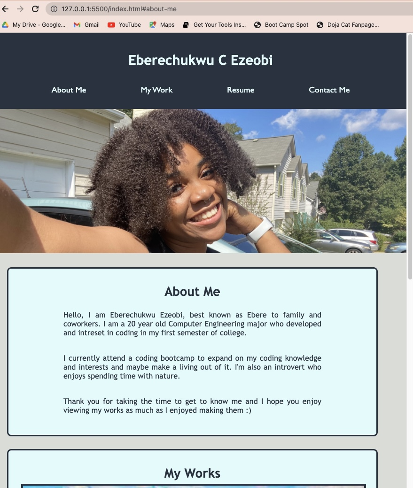
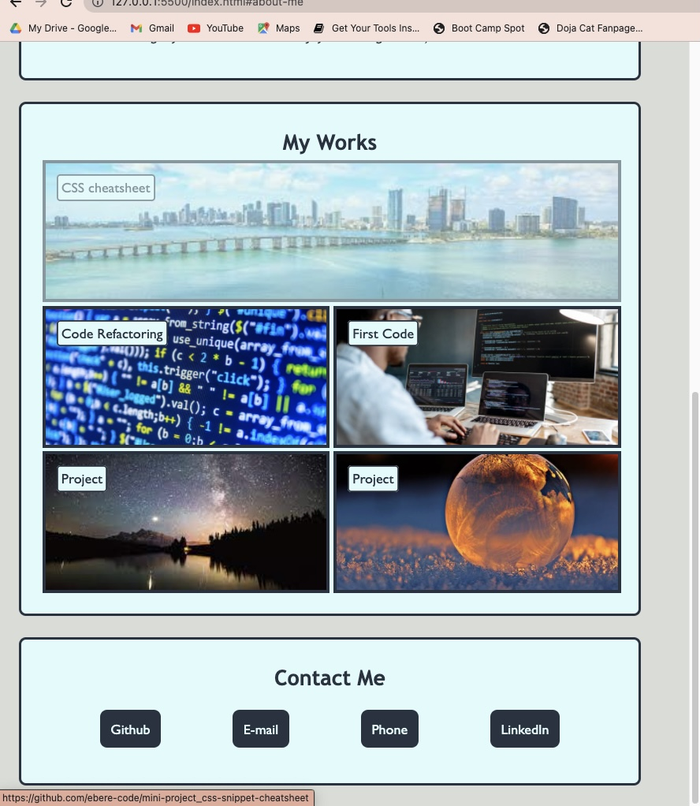
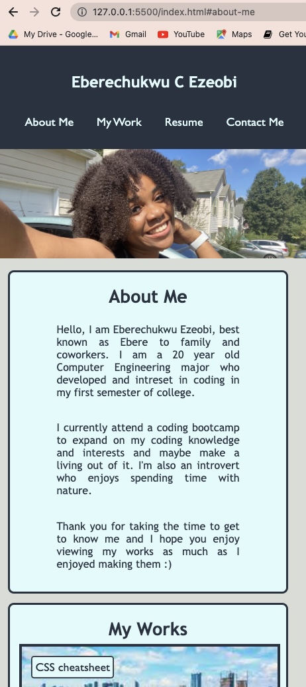
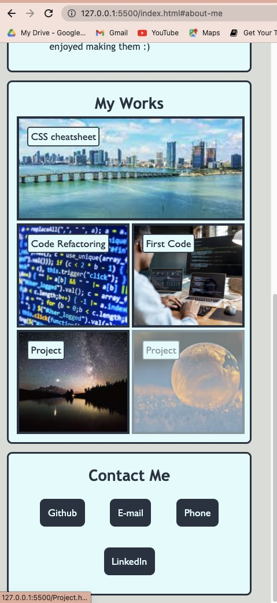

# hw-2-portfolio

## OVERVIEW
The aim of this project was to create a portfolio of my work to showcase my skills.

## Description
* This Website was fully made and designed by me.
* This Website Includes a Header containg my name and links to diferent sections of the page; and a body section containg 3 sections; About me, my works and how to contact me. 
* This apllication is interactive and contains a responsive layout that adapts to my viewport. 
* Application has been deployed to Github pages.

## SCREENSHOTS

* Screenshot of the top of desktop page
 

* Screenshot of the bottom of desktop page

* Screenshot of the top of Tablet page

* Screenshot of the bottom of Tablet page

* Screenshot of the top of mobile page

* Screenshot of the bottom of mobile page

## LINK TO DEPLOYED PAGE

 https://ebere-code.github.io/portfolio/
